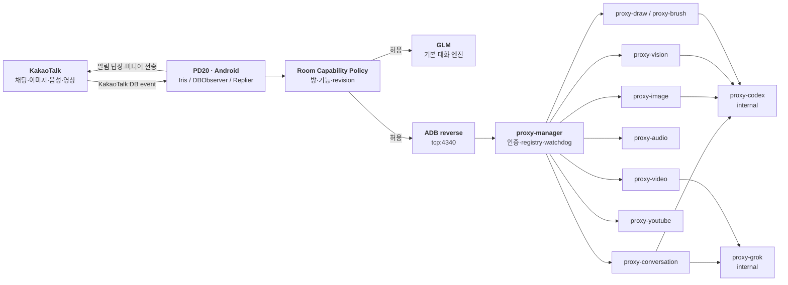

<h1 align="center">헤이봇 · KakaoTalk AI Automation</h1>

<p align="center">

  
  
  루팅된 Android 단말의 카카오톡 DB 이벤트를 기반으로 동작하는<br />
  <strong>방 단위 권한·멀티 엔진 대화·미디어 생성/분석</strong> 자동화 시스템
</p>

<p align="center">
  <a href="https://github.com/coreline-ai/kakao-heybot-auto"></a>
  <a href="https://github.com/coreline-ai/kakao-heybot-auto"></a>
  <a href="vendor/android"></a>
  <a href="vendor/android"></a>
  <a href="vendor/server"></a>
</p>

<p align="center">
  <a href="docs/GLM_자동응답_운영설정.md"></a>
  <a href="scripts/start_iris_glm_pd20.sh"></a>
  <a href="#라이선스와-배포"></a>
</p>

> [!WARNING]
> 이 프로젝트는 **루트 권한이 있는 Android 단말**, 카카오톡 DB 접근 및 외부 AI/미디어 서비스 연동을 전제로 합니다. 실제 운영 전에는 카카오 서비스 약관, 적용 법령, 사내 보안 정책 및 AI 제공자 약관을 반드시 검토하세요.

## 목차

- [프로젝트 개요](#프로젝트-개요)
- [핵심 기능](#핵심-기능)
- [아키텍처](#아키텍처)
- [카카오톡 사용법](#카카오톡-사용법)
- [방 단위 권한과 관리자](#방-단위-권한과-관리자)
- [구성 요소](#구성-요소)
- [빠른 시작](#빠른-시작)
- [운영과 보안](#운영과-보안)
- [테스트와 검증](#테스트와-검증)
- [프로젝트 구조](#프로젝트-구조)
- [문서](#문서)
- [기여 및 소스 관리](#기여-및-소스-관리)
- [라이선스와 배포](#라이선스와-배포)

---

## 프로젝트 개요

**헤이봇(HeyBot)**은 카카오톡 오픈채팅/그룹채팅에서 `헤이봇` 호출어를 받아 대화와 AI 작업을 수행하는 Android 중심 자동화 시스템입니다.

- **Android 단말**은 카카오톡 DB를 감시하고, 카카오톡의 알림 답장 서비스로 결과를 전송합니다.
- **GLM**은 Android에서 직접 호출하는 기본 대화 엔진입니다. 서버가 일시적으로 연결되지 않아도 호출어 기반 기본 대화의 기반을 유지합니다.
- **Codex/Grok**은 Mac의 프록시 스택을 통해 선택할 수 있는 대화·생성 엔진입니다.
- **프록시 매니저**는 단일 loopback 진입점에서 기능별 프록시를 분리하고, 인증·준비 상태·큐·watchdog를 관리합니다.
- **방 capability 정책**은 텍스트, 일반대화, 이미지, 영상, 이미지 분석, 음성 분석 등 기능별 허용 여부를 각 방마다 독립적으로 적용합니다.

### 설계 원칙

| 원칙 | 적용 방식 |
| --- | --- |
| 최소 권한 | 방별 capability가 기본 차단(fail-closed)으로 동작합니다. |
| 단일 제어실 | 관리자 명령과 방 권한 변경은 `코어라인 AI 연구소` 제어 방에서만 허용합니다. |
| 안전한 비밀 관리 | API key·route secret·관리자 ID는 소스가 아닌 root 전용 런타임 파일에서 읽습니다. |
| 장애 격리 | GLM, 대화 프록시, 이미지, Vision, 음성, 영상, YouTube 작업은 별도 계약·큐·상태를 가집니다. |
| 전송 확인 | 비동기 미디어 작업은 요청/작업/카카오 DB 전송 확인을 분리해 추적합니다. |
| 대화 연속성 | 사용자별 대화 기억과 이미지·음성 분석의 안전 처리된 후속 문맥을 분리 저장합니다. |

---

## 핵심 기능

모든 기능은 **프록시 준비 상태**, **방 권한**, **요청 형식**, **큐 여유**가 동시에 충족될 때만 실행됩니다. 실제 허용 방 목록은 카카오톡에서 `헤이봇 카톡방`으로 확인합니다.

| 영역 | 제공 기능 | 실행 조건 |
| --- | --- | --- |
| 💬 대화 | `헤이봇`이 문장 어디에 있어도 질문 응답, 사용자별 문맥 유지 | 텍스트 권한 |
| 🧠 일반대화 | 호출어 없는 일반 대화의 전역 ON/OFF | 관리자 활성화 + 방별 일반대화 권한 |
| 🔀 엔진 전환 | 기본(GLM)·Codex·Grok 대화 엔진을 전역 전환 | 제어 방 관리자 + 해당 프록시 준비 상태 |
| 🖼️ 이미지 생성 | 프롬프트 기반 이미지 생성, 상태/취소/재전송 | 이미지 권한 + Image/Codex 경로 준비 |
| 👁️ 이미지 분석 | 최근 이미지 또는 답장 이미지 설명, OCR, 한국어 번역, 후속 질문 | 이미지분석 권한 + Vision 경로 준비 |
| 🎬 영상 생성 | 프롬프트 기반 짧은 영상 생성, 상태/취소/재전송 | 영상 권한 + Video/Grok 경로 준비 |
| 🖌️ 펜브러쉬 | 펜 외곽선 → 브러시 채색 방식의 영상 생성 | 펜브러쉬 권한 + Draw/Brush 경로 준비 |
| ▶️ YouTube | 단일 공개 YouTube 영상 다운로드·품질 조정·카카오 전송 | 유튜브 권한 + YouTube 경로 준비 |
| 🎙️ 음성 STT/요약 | MP3·M4A·WAV 한국어 전사, 유형별 요약, 원문/근거/후속 질문 | 음성 권한 + Audio 경로 준비 |
| 🛠️ 운영 | 상태, 최근 요청 진단, 자체진단, 방 권한 변경 | 제어 방 관리자 |

### 대화 엔진

| 엔진 | 경로 | 적합한 사용 |
| --- | --- | --- |
| **기본 (GLM)** | PD20 Android → GLM API | 빠른 기본 응답, 서버 경로 장애 시 기본 대화 |
| **Codex** | PD20 → proxy-manager → proxy-conversation → proxy-codex | 코드·구조화·고난도 추론 성격의 대화 |
| **Grok** | PD20 → proxy-manager → proxy-conversation → proxy-grok | 별도 Grok CLI 계약이 준비된 대화/미디어 작업 |

> [!NOTE]
> 엔진 선택은 응답의 **모델 경로**만 바꾸며, 헤이봇의 호출어·권한·안전 필터·카카오 전송 경계는 동일하게 유지됩니다.

---

## 아키텍처



### 처리 흐름

1. **수신**: `DBObserver`가 카카오톡 `chat_logs`의 새 이벤트를 감지합니다.
2. **정규화**: 메시지, 답장 대상, 이미지/음성 attachment를 필요한 최소 메타데이터로 해석합니다.
3. **정책 판정**: 방 등록 여부, 기능 capability, 관리자 권한, 중복/속도 제한을 검사합니다.
4. **실행**: 단순 명령은 Android에서 처리하고, 비동기 AI/미디어 작업은 `proxy-manager`로 보냅니다.
5. **상태 추적**: 요청 trace, job 상태, capability revision을 기록해 잘못된 방으로의 결과 전송을 막습니다.
6. **전달 확인**: 결과를 카카오톡으로 보낸 뒤 카카오 DB의 발신 evidence를 확인합니다.

### 프록시 경계

| 프록시 | 노출 | 책임 |
| --- | --- | --- |
| `proxy-manager` | `127.0.0.1:4340` gateway | route secret 인증, registry 분기, readiness, watchdog, 관리 API |
| `proxy-conversation` | `/v1/conversation` | Codex/Grok 대화 엔진 계약과 엔진 분기 |
| `proxy-image` | `/v1/image` | 이미지 생성 job, 픽셀 QC, artifact 전달 |
| `proxy-vision` | `/v1/vision` | 카카오 이미지 출처 검증, 설명/OCR/번역 job |
| `proxy-audio` | `/v1/audio` | 음성 파일 검증, FFmpeg 처리, 한국어 STT, 요약 계약 |
| `proxy-video` | `/v1/video` | 영상 생성 job, MP4 QC, 전달 상태 관리 |
| `proxy-youtube` | `/v1/youtube` | 공개 YouTube 단일 영상 수집·규격화·MP4 제공 |
| `proxy-draw` / `proxy-brush` | 기능 내부 경로 | 펜브러쉬용 이미지/드로잉 렌더링 경계 |
| `proxy-codex` | internal only | Codex CLI 인증·전역 큐·격리 workspace·artifact 경계 |
| `proxy-grok` | internal only | Grok CLI 인증·전역 실행 경계 |

> `proxy-codex`와 `proxy-grok`는 외부 gateway route를 직접 노출하지 않습니다. 도메인 프록시만 허용된 내부 계약으로 호출합니다.

---

## 카카오톡 사용법

### 기본 대화와 기억

```text
헤이봇 오늘 할 일을 세 가지로 정리해줘
헤이봇 내 기억 초기화
헤이봇 카톡방
헤이봇 기능 이미지 분석
```

- `헤이봇`은 문장 시작뿐 아니라 중간·끝에 있어도 호출어로 인식합니다.
- 대화 기억은 같은 **방 + 사용자** 기준으로 분리됩니다.
- 기억 초기화는 내 대화 기억과 나의 이미지·음성 후속 문맥을 삭제합니다.

### 이미지

```text
헤이봇 이미지 분홍색 로봇이 별을 들고 있는 3D 일러스트
헤이봇 이미지 상태
헤이봇 이미지 취소
헤이봇 이미지 재전송

[이미지를 올린 뒤]
헤이봇 이미지 분석
헤이봇 이미지 글자 추출
헤이봇 이미지 글자 번역
헤이봇 그 이미지에서 가방은 무슨 색이야?
```

- 분석 명령에 답장을 달면 해당 이미지를 우선 사용합니다.
- 답장이 없으면 같은 방의 최근 분석 가능한 이미지를 사용합니다.
- 이미지 분석 결과는 안전 처리된 문맥으로만 보관되며, 후속 질문은 사용자별 30분·같은 방 참여자 공유 5분 창을 따릅니다.

### 영상·펜브러쉬·YouTube

```text
헤이봇 영상 핑크 로봇이 카메라를 보며 손을 흔드는 3초 세로 영상
헤이봇 영상 상태
헤이봇 영상 취소
헤이봇 영상 재전송

헤이봇 펜브러쉬 하얀 종이 위 핑크 로봇 캐릭터가 손을 흔드는 모습
헤이봇 펜브러쉬 상태

헤이봇 유튜브 다운로드 https://www.youtube.com/watch?v=VIDEO_ID
헤이봇 유튜브 상태
헤이봇 유튜브 취소
헤이봇 유튜브 재전송
헤이봇 유튜브 삭제
```

- 비디오 작업은 방별 단일 전송 gate로 중복 전송을 막고, 카카오 처리 확인이 늦어도 자동 재전송하지 않습니다.
- YouTube는 **단일 공개 영상**만 지원합니다. 재생목록·로그인 필요·DRM 콘텐츠는 지원하지 않습니다.
- YouTube의 다운로드·이용은 저작권 및 서비스 약관을 준수해야 합니다.

### 음성 STT·요약

```text
[MP3·M4A·WAV를 같은 방에 올린 뒤]
헤이봇 음성 요약
헤이봇 음성 요약 회의 회의록
헤이봇 음성 요약 강의 타임라인
헤이봇 음성 원문 1
헤이봇 음성 근거 1
헤이봇 음성 상태
헤이봇 음성 취소
헤이봇 음성 재요약
헤이봇 음성 재전송
헤이봇 음성 삭제
```

지원 유형은 `자동·일반·회의·인터뷰·강의·통화·상담·업무보고·질의응답`이며, 보기 형식은 `짧게·기본·상세·액션·타임라인·회의록`입니다.

---

## 방 단위 권한과 관리자

### 권한 모델

각 방에는 다음 capability가 독립적으로 존재합니다.

| Capability | 의미 | 비고 |
| --- | --- | --- |
| `텍스트` | 호출어 기반 텍스트 대화 | 제어 방의 텍스트 권한은 끌 수 없음 |
| `일반대화` | 호출어 없는 일반 대화 | 텍스트가 허용된 방에서만 활성화 가능 |
| `이미지` | 이미지 생성 | 이미지 분석과 별도 |
| `영상` | 영상 생성 | 기본 차단 |
| `유튜브` | YouTube 다운로드 | 영상 생성과 별도 |
| `펜브러쉬` | 펜/브러시 채색 영상 | 기본 차단 |
| `이미지분석` | 이미지 설명·OCR·번역 | 이미지 생성과 별도 |
| `음성` | 수동 STT·요약 | 음성자동과 별도 |
| `음성자동` | 음성 업로드 직후 자동 분석 | 텍스트·음성 권한이 모두 필요 |

정책은 Android의 root 전용 파일에 원자적으로 저장되며, 각 capability의 revision을 통해 **권한이 바뀐 뒤 이전 작업 결과가 전송되는 상황**을 차단합니다.

### 관리자 운영 명령

관리자 명령은 **코어라인 AI 연구소 제어 방**에서 인증된 관리자만 실행할 수 있습니다.

```text
# 일반대화 전체 스위치
헤이봇 대화 시작
헤이봇 대화 상태
헤이봇 대화 종료

# 전역 응답 엔진
헤이봇 대화 기본
헤이봇 대화 코덱스
헤이봇 대화 그록

# 방 정책 확인 및 변경 (예: R03)
헤이봇 방 목록
헤이봇 방 상태 R03
헤이봇 이미지분석 허용 R03
헤이봇 방 적용 <확인코드>
헤이봇 이미지분석 불허용 R03
헤이봇 방 취소

# 운영 진단
헤이봇 상태
헤이봇 설정 보기
헤이봇 최근 진단 R03
헤이봇 자체진단 빠른
```

권한 변경은 즉시 적용하지 않고 **미리보기 → 확인 코드 → 적용**의 2단계로 완료합니다. `헤이봇 카톡방`은 현재 방의 R번호와 기능별 허용 상태를 표시합니다.

---

## 구성 요소

### Android: `vendor/android`

| 항목 | 내용 |
| --- | --- |
| namespace / applicationId | `ai.coreline.heybot` |
| 최소 SDK | API 26 |
| 컴파일 SDK | 35 |
| Kotlin / Java | Kotlin, JVM 17 |
| 진입점 | `app_process / ai.coreline.heybot.Main` |
| 운영 단말 | PD20 `0123456789ABCDEF` |
| 핵심 역할 | 카카오 DB 감시, 호출어/정책 처리, GLM 대화, 프록시 client, 카카오 전송, 요청 추적 |

### Server: `vendor/server`

| 영역 | 주요 역할 |
| --- | --- |
| `proxy-manager` | 단일 gateway, 각 프록시 registry, 인증, readiness, watchdog, launchd 연동 |
| `proxy-conversation` | 선택된 Codex/Grok 대화 엔진으로 요청을 전달 |
| `proxy-image` / `proxy-vision` | 생성 이미지 QC 및 사용자 이미지 분석 출처 검증 |
| `proxy-audio` | 지원 음성 포맷 검사, 전사 데이터 보호, STT·요약 |
| `proxy-video` / `proxy-youtube` | 영상 job, 파일 검사, 카카오 전송을 위한 artifact 제공 |
| `proxy-draw` / `proxy-brush` | 펜브러쉬 영상을 위한 이미지와 드로잉 단계 |
| `proxy-codex` / `proxy-grok` | AI CLI 인증/실행/큐를 도메인 기능으로부터 격리 |

---

## 빠른 시작

> [!IMPORTANT]
> 아래는 개발·운영 구조를 이해하기 위한 최소 절차입니다. 실제 토큰, 관리자 ID, 카카오톡 로그인 단말 및 외부 CLI 인증은 이 저장소에 포함되지 않습니다. 상세 운영 절차는 [GLM 자동응답 운영 설정](docs/GLM_자동응답_운영설정.md)을 기준으로 하세요.

### 1. 요구 사항

| 위치 | 요구 사항 |
| --- | --- |
| Mac 서버 | macOS, Node.js 24+, npm, `curl`, `openssl`, 필요한 AI CLI 인증 |
| Android 빌드 | Android SDK, JDK 17, Gradle wrapper |
| Android 운영 | 루트 권한 Android, 카카오톡 로그인, `adb`, PD20 연결 |
| 네트워크 | PD20 ↔ Mac 프록시 경로용 `adb reverse tcp:4340 tcp:4340` |

### 2. 저장소 준비

```bash
git clone https://github.com/coreline-ai/kakao-heybot-auto.git
cd kakao-heybot-auto

# Android 단위 테스트와 release APK 생성
cd vendor/android
./gradlew testReleaseUnitTest assembleRelease
cd ../..
```

생성된 APK는 `vendor/android/output/Iris-release.apk`에 배치됩니다.

### 3. 서버 프록시 스택 준비

```bash
cd vendor/server

# proxy 별 route/internal/admin secret 생성 (runtime 디렉터리는 Git 미추적)
./scripts/bootstrap-secrets.sh

# 빌드·시작·readiness 확인
./scripts/start-stack.sh

# health, watchdog, proxy 계약, Android 빌드 검증
./scripts/self-test-stack.sh
```

운영 중지:

```bash
cd vendor/server
./scripts/stop-stack.sh
```

### 4. PD20 배포

배포 전에 다음 root 전용 파일을 PD20의 `/data/local/private/`에 준비해야 합니다.

| 파일 | 용도 | 요구 권한 |
| --- | --- | --- |
| `iris-glm.token` | GLM API 토큰 | `root:root`, `0600` |
| `iris-bot-admins.txt` | 관리자 카카오 user ID 목록 | `root:root`, `0600` |
| `iris-room-capabilities.json` | 방 capability 정책 | `root:root`, `0600` |
| `iris-*-proxy.token` | Android → proxy-manager route secret 사본 | `root:root`, `0600` |

표준 배포 스크립트는 파일의 **내용이 아니라 소유자·권한·존재 여부만 검사**한 뒤 APK와 필요한 route secret을 전달합니다.

```bash
# 저장소 루트에서 실행
scripts/start_iris_glm_pd20.sh
```

이 스크립트는 PD20 serial을 `0123456789ABCDEF`로 고정합니다. 기동 뒤 카카오톡 허용 방에서 다음으로 기본 동작을 점검할 수 있습니다.

```text
헤이봇 안녕
헤이봇 카톡방
```

### 5. 기능 활성화의 3중 조건

어떤 비기본 기능도 다음 세 조건이 모두 참일 때만 실행됩니다.

```text
기능 프록시가 registry에서 enabled·ready
             AND
Android 실행 환경/route secret이 준비됨
             AND
해당 방 capability가 허용됨
```

따라서 서버 stack을 올렸더라도 방 권한이 불허용이면 작업은 시작되지 않으며, 반대로 방 권한만 허용해도 프록시가 준비되지 않으면 안전한 실패 안내를 반환합니다.

---

## 운영과 보안

### 비밀과 데이터

| 대상 | 처리 원칙 |
| --- | --- |
| API key / CLI 인증 | 저장소, APK, stdout, shell history에 넣지 않습니다. |
| Route/internal/admin secret | 기능별로 분리하고 runtime `secrets/`에 `0600`으로 둡니다. |
| Android 운영 파일 | `/data/local/private/` 아래 root 전용(`0700` 디렉터리)으로 둡니다. |
| 프롬프트·대화 원문 | 운영 로그와 Git 커밋에 불필요하게 남기지 않습니다. |
| 요청 진단 | 안정된 reason code와 단계 중심으로 기록합니다. |
| 이미지/음성 artifact | 기능별 retention cleanup 대상으로 두고 장기 보관하지 않습니다. |

### 안전장치

- 일반대화는 오류·429·timeout이 임계치를 넘으면 자동 OFF되고, 호출어 기반 기능은 유지됩니다.
- 출력은 비밀값 형태, 이메일·전화·주민등록번호·카드번호 패턴을 정리하는 공통 safety 경계를 거칩니다.
- 이미지·음성·미디어 job은 `chatId` 소유권을 확인하므로 다른 방의 상태/파일을 조회하거나 전달할 수 없습니다.
- 답장으로 지정된 이미지와 음성은 동일 방의 source log인지 다시 확인합니다.
- 비디오와 YouTube 전송은 카카오 DB evidence 확인 전 자동 중복 전송하지 않습니다.
- HTTP 관리 API는 기본 비활성입니다. 활성화해도 loopback과 Bearer secret이 모두 필요합니다.

### 상태 확인

| 확인 위치 | 방법 |
| --- | --- |
| 카카오톡 사용자 | `헤이봇 상태`, `헤이봇 최근 진단 [R번호]`, `헤이봇 카톡방` |
| Android 단말 | `scripts/run_heybot_self_test_pd20.sh quick` |
| 프록시 스택 | `vendor/server/scripts/self-test-stack.sh` |
| macOS 상시 실행 | 각 proxy의 `doctor.sh`, `launchctl print`, manager `/ready` |

---

## 테스트와 검증

### 코드 검증

```bash
# Android
cd vendor/android
./gradlew testReleaseUnitTest assembleRelease

# Server: 각 proxy TypeScript 빌드 및 테스트
cd ../server
./scripts/self-test-stack.sh
```

### PD20 자체진단

```bash
# 저장소 루트
scripts/run_heybot_self_test_pd20.sh quick
scripts/run_heybot_self_test_pd20.sh integration
scripts/run_heybot_self_test_pd20.sh device
```

| 모드 | 범위 | 카카오톡 외부 전송 |
| --- | --- | --- |
| `quick` | 순수 Android 설정·파서·정책 계약 | 없음 |
| `integration` | 프록시 준비 상태와 Android 통합 계약 | 없음 |
| `device` | PD20 파일·권한·연결 조건 | 없음 |
| `canary` | 명시적 승인된 실전 E2E 경로 | 승인 없이는 skip |

### 명시적 실전 canary

아래 스크립트는 실제 카카오톡 전송 또는 외부 작업을 유발할 수 있으므로, 테스트 방·테스트 파일·권한을 확인한 경우에만 실행합니다.

```bash
# M4A/MP3/WAV fixture를 통한 R01 음성 분석 턴
scripts/run_live_audio_canary_pd20.sh

# 공개 YouTube 단일 영상의 다운로드·카카오 DB 전송 확인
scripts/run_live_youtube_canary_pd20.sh
```

이미지 Vision E2E도 앱 내부에서 **명시적 확인 값**을 요구하도록 설계되어 있습니다. 이 원칙은 실사용자 방에 의도하지 않은 테스트 메시지를 보내지 않기 위한 것입니다.

---

## 프로젝트 구조

```text
.
├── README.md                         # 이 문서
├── AGENTS.md                         # 기능·도움말·PD20 개발 규칙
├── assets/                           # 헤이봇 이미지 자산
├── config/
│   └── iris-room-capabilities.bootstrap.json
├── docs/                             # 운영·검증·소스 관리 문서
├── dev-plan/                         # 기능별 개발 계획과 완료 기록
├── scripts/                          # PD20 배포·진단·실전 canary
└── vendor/
    ├── android/                      # ai.coreline.heybot Android/Iris runtime
    │   ├── app/src/main/java/ai/coreline/heybot/
    │   └── app/src/test/
    └── server/                       # macOS proxy workspace
        ├── proxy-manager/            # gateway·registry·watchdog
        ├── proxy-conversation/       # GLM 외 대화 엔진 route
        ├── proxy-image/              # 이미지 생성
        ├── proxy-vision/             # 이미지 분석/OCR/번역
        ├── proxy-audio/              # STT·요약
        ├── proxy-video/              # 영상 생성
        ├── proxy-youtube/            # YouTube 다운로드
        ├── proxy-draw/               # 드로잉 준비
        ├── proxy-brush/              # 펜브러쉬 렌더
        ├── proxy-codex/              # Codex CLI 내부 실행
        └── proxy-grok/               # Grok CLI 내부 실행
```

---

## 문서

| 문서 | 내용 |
| --- | --- |
| [GLM 자동응답 운영 설정](docs/GLM_자동응답_운영설정.md) | 토큰·정책·프록시·ADB reverse·배포·장애 대응 운영 기준 |
| [GLM 구현 검증 매트릭스](docs/GLM_구현_검증_매트릭스.md) | 구현 요구사항과 코드/테스트/실기기 증거 연결 |
| [카카오톡봇 설치운영 가이드](docs/카카오톡봇_설치운영가이드.md) | Android/Iris 기반 설치·운영 참고 |
| [보안 검토](docs/security_best_practices_report.md) | 현재 코드의 보안 점검 결과와 권장 보완 |
| [소스 관리 정책](docs/소스_관리_정책.md) | new-bot 저장소 경계, 미추적 대상, old-bot 참조 원칙 |
| [개발 계획 목록](dev-plan/README.md) | 기능별 설계·구현·검증 문서 인덱스 |
| [Android README](vendor/android/README.md) | Android/Iris runtime의 역사적 API 문서와 운영 식별값 |
| [Server README](vendor/server/README.md) | 프록시 workspace와 component별 상세 문서 링크 |

---

## 기여 및 소스 관리

1. 기능을 추가하거나 명령 문법을 바꾸면 Android parser/router, `HeybotSkillCatalog`, 카카오톡 도움말, 테스트, 운영 문서를 **같은 변경**에 반영합니다.
2. 기능별 사용자 호출어는 `헤이봇 도움말`에서 확인 가능해야 하며, 카카오톡 메시지 길이 제한을 지켜야 합니다.
3. 새 프록시는 `proxy-<feature>` 단위로 격리하고, manager registry·인증·readiness·테스트·운영 문서를 함께 추가합니다.
4. API key, route/internal/admin secret, 로그인 인증, runtime artifact, 로그, APK/build output은 커밋하지 않습니다.
5. Android 실기기 검증 대상은 PD20 `0123456789ABCDEF`입니다. 단말 조작은 ADB·DB·코드 경로로만 수행합니다.
6. `old-bot`은 별도 저장소이며, 현재 new-bot에는 라이선스 검토 목적의 참조 외 코드를 복사하지 않습니다.

변경 전에 반드시 다음을 확인하세요.

```bash
git status --short
git diff --check
```

---

## 라이선스와 배포

현재 이 저장소의 최상위에는 배포 라이선스를 선언하는 `LICENSE` 파일이 없습니다. 따라서 이 README는 사용·복제·재배포 권한을 새로 부여하지 않습니다.

- 외부 공개 또는 상용 배포 전에는 코드의 저작권 소유자와 함께 적절한 최상위 라이선스를 명시하세요.
- `vendor/`의 각 구성 요소 및 사용한 외부 CLI/라이브러리의 라이선스를 별도로 검토하세요.

---

<p align="center">
  <strong>HeyBot</strong> · Coreline AI<br />
  <sub>권한이 허용된 방에서만, 필요한 기능만, 추적 가능한 방식으로.</sub>
</p>
